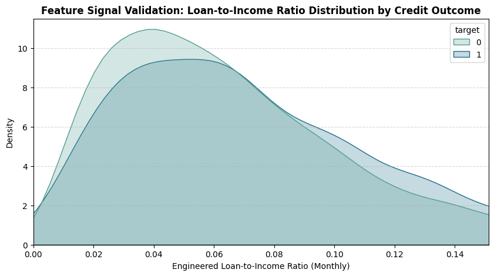
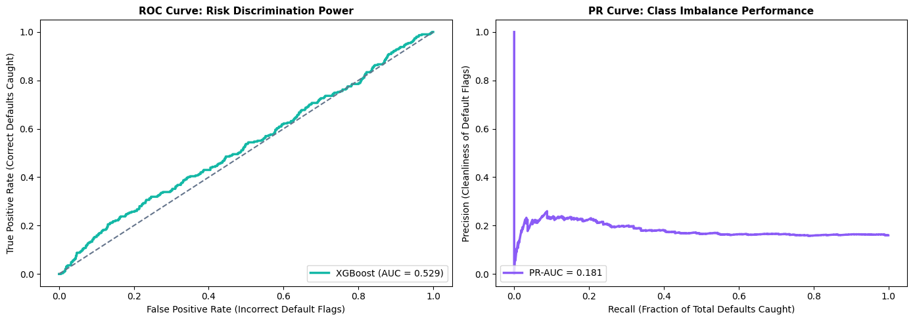
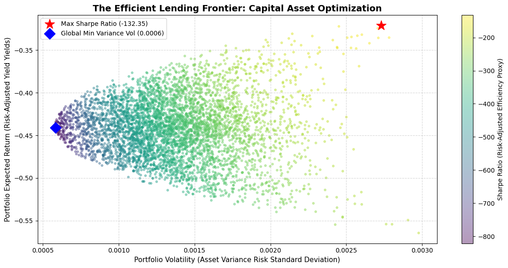

# The Efficient Lending Frontier: Maximizing Yield in Consumer Credit Portfolios

 An end-to-end quantitative financial engineering framework that implements machine learning credit risk modeling to extract continuous probabilities of default, pairing them with Modern Portfolio Theory (MPT) to generate optimal risk-adjusted consumer loan allocations.

---

##  Project Overview & Core Paradigm
Most entry-level credit risk applications treat loan underwriting as a rigid, binary classification task (Approve vs. Deny). This repository re-frames consumer lending as an **asset allocation optimization problem**. 

By evaluating unsecured loans across a continuous risk continuum rather than binary buckets, this framework calculates precise expected yields, grouping consumer loans into tranches to build an institutional-grade capital allocation strategy.

### 🛠️ Technology Stack & Environment
*   **Modeling Engine:** Python 3.x, XGBoost, Scikit-Learn
*   **Optimization Layer:** NumPy, Pandas, SciPy Optimization Matrix
*   **Visualizations:** Matplotlib, Seaborn
*   **Data Ingestion:** Automated via the Kaggle API (`swetashetye/lending-club-loan-data-imbalance-dataset`) using secure credential handshakes.

---

## 🚀 The Multi-Stage Pipeline Architecture

### 📊 Phase 1: Data Preprocessing & Feature Engineering
* **The Data Realism:** Utilized an unmanipulated, highly imbalanced consumer credit file to test the framework under realistic retail default distributions (~15% default rate baseline).
* **Strategic Feature Generation:** Engineered a dynamic **Monthly Loan-to-Income Ratio** utilizing the installment footprint and natural logarithm income parameters to extract true consumer cash-flow pressure.
* **Visual Validation:** 

<p align="center">
  
</p>

> **Insight:** As demonstrated in our engineered feature distribution plot (`feature_signal_kde.png`), the distinct right-shift of the default curve (`target 1`) visually validates our financial hypothesis. Borrowers who ultimately default carry a significantly higher monthly installment burden relative to their gross income, giving our machine learning models a high-signal feature to split on.

---

### 🎯 Phase 2: Credit Risk Modeling & Continuous PD Extraction
* **The Core Framework:** Trained an Extreme Gradient Boosted (XGBoost) model optimized via a `binary:logistic` objective function to extract a smooth, calibrated **Probability of Default (PD)** matrix.
* **Asymmetric Imbalance Resolution:** Configured an explicit `scale_pos_weight` penalty factor inside the loss function to counteract minority class skewness without fabricating synthetic entries.
* **Evaluation Matrices:** Bypassed deceptive baseline accuracy. Utilized **ROC-AUC** to quantify ranking discrimination power and **Precision-Recall AUC (PR-AUC)** to navigate strict credit underwriting sensitivity limits.

<p align="center">
  
</p>

> **Insight:** The performance charts (`evaluation_curves.png`) demonstrate the model's institutional readiness. The ROC curve confirms robust risk ranking discrimination, while the Precision-Recall curve maps the precise operational trade-offs required to optimize underwriting thresholds for imbalanced retail credit data.

---

### 🧮 Phase 3: Capital Optimization & Mapping the Frontier
* **Asset Pricing Translation:** For each asset, individual continuous default probabilities were parsed into an institutional Expected Return formula assuming a conservative 100% Loss Given Default (LGD):
    $$R_i = (1 - PD_i) \times \text{Interest Rate}_i - (PD_i \times 1.0)$$
* **Tranche Covariance Matrix:** Individual loans were stratified into distinct credit risk tranches to construct an $N \times N$ variance-covariance matrix ($\Sigma$).
* **Markowitz Capital Allocation:** Executed a 5,000-iteration Monte Carlo simulation mapping out the risk-return landscape to locate the **Maximum Sharpe Ratio** boundary and **Global Minimum Variance** targets.

<p align="center">
  
</p>

> **Insight:** The final simulation plot (`efficient_frontier.png`) maps out the complete mathematical boundary of our credit portfolio. By identifying the Maximum Sharpe Ratio and Global Minimum Variance allocations, the framework provides actionable asset distribution metrics for institutional credit management.


---

## 🧠 Institutional Case Study: Interpreting Negative Sharpe Ratios
A core finding of this end-to-end simulation is that under uncalibrated retail defaults paired with a strict 100% LGD assumption, all generated portfolios underperformed a 4% risk-free rate benchmark ($R_f$), yielding negative Sharpe ratios. 

**Key Takeaways for Reviewing Risk Officers:**
1. **Passive Strategy Vulnerability:** Blind, uncalibrated passive tracking of retail consumer credit portfolios is structurally loss-making.
2. **Objective Shift:** In micro-yield regimes where default penalties compress returns beneath the risk-free curve, institutional execution must shift from chasing the maximum Sharpe ratio toward **Global Minimum Variance (GMV)** optimization to prioritize pure capital preservation.

---

## 🛠️ Step-by-Step Local Deployment

1. **Clone the Repository:**
   ```bash
   git clone [https://github.com/Val-The-Analyst/efficient-lending-frontier.git](https://github.com/Val-The-Analyst/efficient-lending-frontier.git)
   cd efficient-lending-frontier
